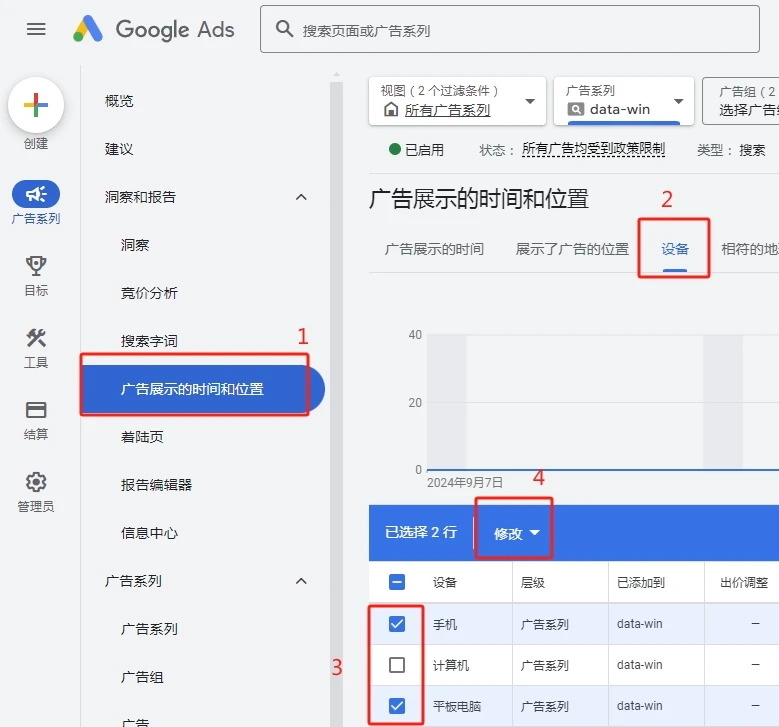

# Google Ads 如何设置只在电脑端展现广告"

记录一下如何设置谷歌广告只在电脑端展现。记得以前 Google Ads 应该是创建广告的时候就可以选择的，现在改了，藏挺深，关键是我搜都没搜出来。问了 [ChatGPT](/tag/chatgpt)，给的答案也是过时的。

这两天尝试投 Google Ads 来做 affiliate，但产品不适合移动端。当时只图快，也不记得要设置移动端和电脑端了。结果几百块丢出去，没听到响。看了下 [Clarity](https://kerrynotes.com/clarity-installation-tutorial/) 的用户访问录像，发现大多是移动设备。这才想起去看报告，显示77%的预算都花在移动流量上了，这才想起要设置这个东西。

## 如何设置谷歌广告仅在电脑端展现

这个内容是我最后看 Google Ads 的帮助文档时发现的，他们把这个放在了“移动广告简介”里，这谁能找到。以下是官方介绍，点击链接可以直接前往设置的地方：

1. 在 Google Ads 帐号中，点击**广告系列**图标 。

3. 点击该版块菜单中的**数据分析和报告**下拉菜单。

5. 点击**[展示广告的时间和位置](https://ads.google.com/aw/adschedule/dayandhour)**。

7. 在顶部菜单栏中，选择**设备**。

9. 在“设备”列中，找到标有“手机”字样的行。

11. 点击要调整出价的广告系列或广告组所相应的“出价调整”单元格。

13. 从下拉菜单中选择**降低**。

15. 在 **%** 字段中输入“100”，然后点击**保存**。

截个图，就是这里：_广告系列 → 广告展示的时间和位置 → 设备 → 选中手机和平板电脑 → 点击修改 → 更改出价调整。_

<figure>

<figcaption>

Google Ads 设置设备出价

</figcaption>

</figure>

将手机和平板电脑的出价降低100%，这样广告就不会在移动端展现了。

<figure>

<figcaption>

移动端出价降低100%

</figcaption>

</figure>
